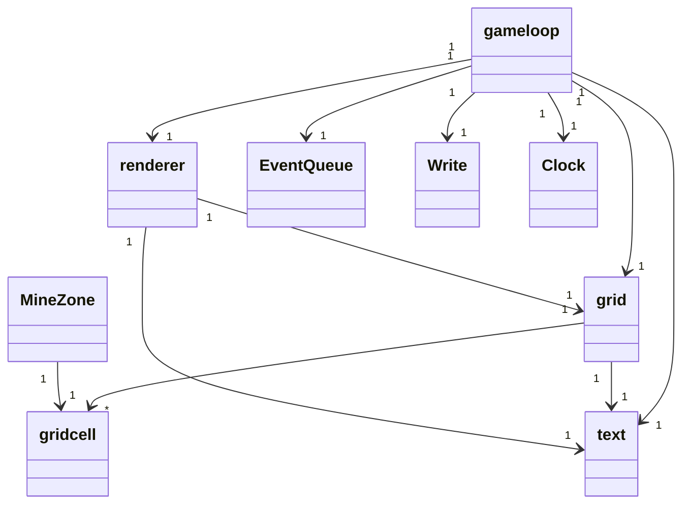

## Sovellus

sovelluksen pääosana on gameloop luokka mikä saa argumentteina Grid, Text, Renderer, EventQueue,Write ja Clock luokat

Intreaktio käyttäjän kanssa tapahtuu renderer ja evenqueue luokkien avulla, renderer näyttää käyttäjälle ruudukon ja eventqueue kerää informaation käyttäjän hiirestä ja näppäimistöstä.

Gameloop filtteröi eventqueuen antamia eventtejä ja kutsuu grid luokan metodia updateclick oikeilla parametreilla ja resetoi ruudukon kun painetaan r. updateclick palauttaa joko true tai false riippuen onko peli ohi klikkauksen aiheuttamana vai ei, jos kyllä se kirjoittaa tuloksen tiedostoon write luokan avulla.

Grid luokan olion luodessa, se tekee tyhjän ruudukon. Kun updateclick kutsutaan sallitussa paikassa ensimmäisen kerran luo grid luokka oikea ruudukon ja avaa tämän ruudun. Ennen ruudun näyttämistä käyttäjälle jos konfiguroitava GEN_GRID on "yes", grid injektoidaan solve funktiolle, mikä yrittää ratkaista ruudukon, jos se ei onnistu yritetään uudestaan 1000 kertaa.
